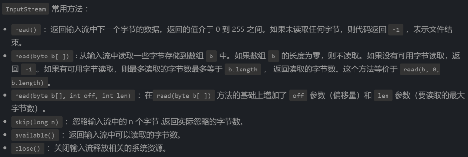
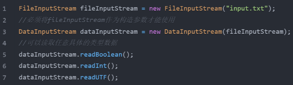
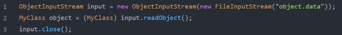
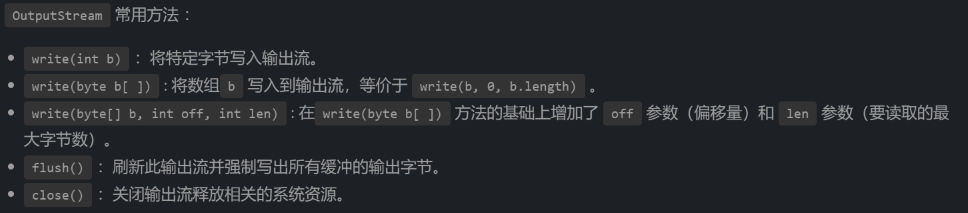
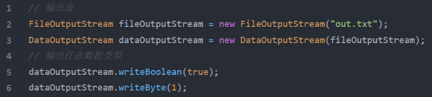
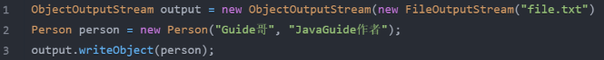
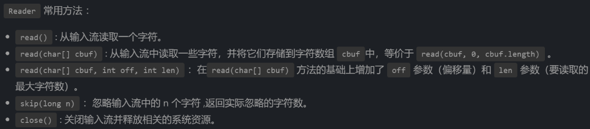
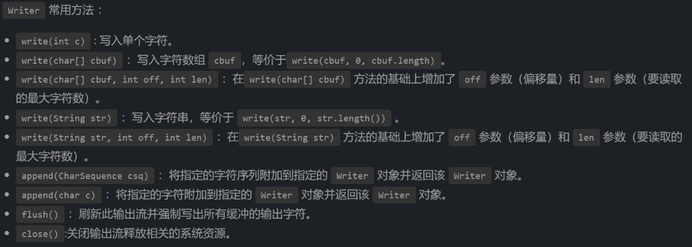
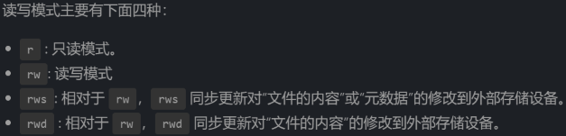
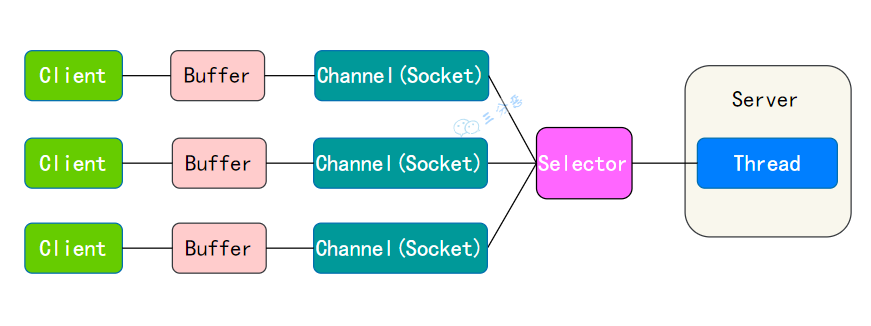

### JAVA IO 

#### java IO 流的 40 多个类都是从如下 4个抽象类基类派生出来的

```java
InputStream/Reader 所有的输入流的基类，前者是字节输入流，后者是字符输入流
OutputStream/Wtiter 所有的输出流的基类，前者是字节输出流，后者是字符输出流
```

音频文件、图片等媒体文件使用字节流比较好，字符的话使用字符流比较好

#### 1、字节流 

##### InputStream（字节输入流）



FileInputStream 是一个比较常用的字节输入流对象，可直接指定文件路径，可以直接读取单字节数据，也可以读取至字节数组中

InputStream fis = new FileInputStream("input.txt")

DataInputStream 用于读取指定类型数据，不能单独使用，必须结合 FileInputStream



ObjectInputStream 用于从输入流中读取 Java 对象（反序列化），ObjectOutputStream 用于将对象写入到输出流(序列化)



用于序列化和反序列化的类必须实现 Serializable 接口，对象中如果有属性不想被序列化，使用 transient 修饰

##### OutputStream（字节输出流）



FileOutputStream 是最常用的字节输出流对象，可直接指定文件路径，可以直接输出单字节数据，也可以输出指定的字节数组。

FileOutputStream output = new FileOutputStream("output.txt")

DataOutputStream 用于写入指定类型数据，不能单独使用，必须结合 FileOutputStream



ObjectInputStream 用于从输入流中读取 Java 对象（ObjectInputStream,反序列化），ObjectOutputStream将对象写入到输出流(ObjectOutputStream，序列化)。



#### 2、字符流

I/O 流操作为什么要分为字节流操作和字符流操作呢？

- 字符流是由 Java 虚拟机将字节转换得到的，这个过程还算是比较耗时
- 不知道编码类型 容易出现乱码问题

字符流默认采用的是 Unicode 编码，可以通过构造方法自定义编码。

- utf8 :英文占 1 字节，中文占 3 字节
- unicode：任何字符都占 2 个字节
- gbk：英文占 1 字节，中文占 2 字节

##### Reader（字符输入流）

Reader 用于读取文本， InputStream 用于读取原始字节



InputStreamReader 是字节流转换为字符流的桥梁，其子类 FileReader 是基于该基础上的封装，可以直接操作字符文件

public class InputStreamReader extends Reader {}

public class FileReader extends InputStreamReader {}

##### Writer（字符输出流）



OutputStreamWriter 是字符流转换为字节流的桥梁，其子类 FileWriter 是基于该基础上的封装，可以直接将字符写入到文件。

public class OutputStreamWriter extends Writer {}

public class FileWriter extends OutputStreamWriter {}

#### 3、字节缓冲流

为提高效率。

字节缓冲流这里采用了装饰器模式来增强 InputStream 和OutputStream子类对象的功能。

eg：可以通过 BufferedInputStream（字节缓冲输入流）来增强 FileInputStream 的功能

BufferedInputStream bufferedInputStream = new BufferedInputStream(new FileInputStream("input.txt"))

字节流和字节缓冲流的性能差别主要体现在我们使用两者的时候都是调用 write(int b) 和 read() 这两个一次只读取一个字节的方法的时候。

由于字节缓冲流内部有缓冲区（字节数组），因此，字节缓冲流会先将读取到的字节存放在缓存区，大幅减少 IO 次数，提高读取效率。

如果是调用 read(byte b[]) 和 write(byte b[], int off, int len) 这两个写入一个字节数组的方法的话，只要字节数组的大小合适，两者的性能差距其实不大。

###### BufferedInputStream：

BufferedInputStream 从源头（通常是文件）读取数据（字节信息）到内存的过程中不会一个字节一个字节的读取，而是会先将读取到的字节存放在缓存区，并从内部缓冲区中单独读取字节。这样大幅减少了 IO 次数，提高了读取效率。

BufferedInputStream 内部维护了一个缓冲区，这个缓冲区实际就是一个字节数组，通过阅读 BufferedInputStream 源码即可得到这个结论。缓冲区的大小默认为 8192 字节

###### BufferedOutputStream

类似于 BufferedInputStream ，BufferedOutputStream 内部也维护了一个缓冲区，并且，这个缓存区的大小也是 8192 字节

#### 4、字符缓冲流

BufferedReader （字符缓冲输入流）和 BufferedWriter（字符缓冲输出流）类似于 BufferedInputStream（字节缓冲输入流）和BufferedOutputStream（字节缓冲输入流），内部都维护了一个字节数组作为缓冲区。不过，前者主要是用来操作字符信息

#### 5、打印流

System.out 实际是用于获取一个 PrintStream 对象，print方法实际调用的是 PrintStream 对象的 write 方法。

 

PrintStream 属于字节打印流，与之对应的是 PrintWriter （字符打印流）。

PrintStream 是 OutputStream 的子类，PrintWriter 是 Writer 的子类。

#### 6、随机访问流

随机访问流指的是支持随意跳转到文件的任意位置进行读写的 RandomAccessFile



RandomAccessFile 中有一个文件指针用来表示下一个将要被写入或者读取的字节所处的位置。

我们可以通过 RandomAccessFile 的 seek(long pos) 方法来设置文件指针的偏移量（距文件开头 pos 个字节处）。

如果想要获取文件指针当前的位置的话，可以使用 getFilePointer() 方法。

 

RandomAccessFile 的 write 方法在写入对象的时候如果对应的位置已经有数据的话，会将其覆盖掉。

RandomAccessFile 比较常见的一个应用就是实现大文件的 断点续传 。

#### Java IO设计模式总结

装饰器（Decorator）模式 可以在不改变原有对象的情况下拓展其功能

FilterInputStream （对应输入流）和FilterOutputStream（对应输出流）是装饰器模式的核心，分别用于增强 InputStream 和OutputStream子类对象的功能


BufferedInputStream(字节缓冲输入流)、DataInputStream 是FilterInputStream 的子类，

BufferedOutputStream（字节缓冲输出流）、DataOutputStream 是FilterOutputStream的子类


举例：通过 BufferedInputStream（字节缓冲输入流）来增强 FileInputStream 的功能。

BufferedInputStream bis = new BufferedInputStream(new FileInputStream("input.txt"))


### BIO、NIO、AIO


#### **BIO(blocking I/O)**

- 客户端有连接请求时服务器端就需要启动一个线程进行处理

- 适用于连接数目比较小且固定的架构

#### **NIO(java non-blocking IO)**：同步非阻塞

- 从 JDK1.4 开始，服务器端用**一个线程处理多个连接**，客户端发送的连接请求会注册到多路复用器上，用**轮询**代替了始终保持一个连接
- 客户端**不能做其他事情**
- NIO 的数据是面向缓冲区 Buffer的，必须从 Buffer 中读取或写入



NIO 的运行机制

- ·每个 Channel 对应一个 Buffer。
- Selector 对应一个线程，一个线程对应多个 Channel。
- Selector 检查多个Channel的状态变更情况。
- Buffer 是内存块，底层是数据
- Channel 是运输数据的载体

#### **AIO( Asynchronous I/O)****：异步非阻塞**

- JDK 7 引入
- 客户端在请求数据的过程中，服务器端用**一个线程处理多个连接**
- 客户端**可以做其他**事情
-  I/O 编程中，常用到两种模式：Reactor 和 Proactor ，NIO是Reactor

