### **Java 内存区域详解**

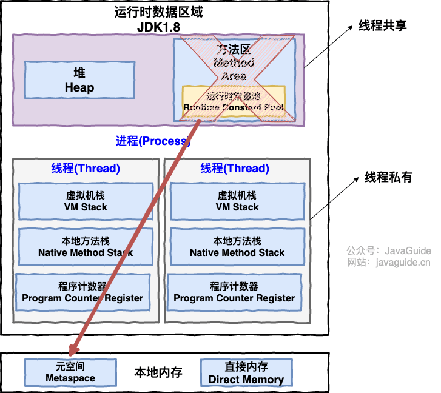

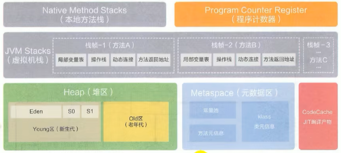

**※** **Java 虚拟机栈**

Java 虚拟机栈（后文简称栈）也是线程私有的，它的生命周期和线程相同，随着线程的创建而创建，随着线程的死亡而死亡。

**除了一些 Native 方法调用是通过本地方法栈实现**的(后面会提到)，**其他所有的 Java 方法调用都是通过虚拟机栈**来实现的

方法调用的数据需要通过栈进行传递，每一次方法调用都会有一个对应的栈帧被压入栈中，每一个方法调用结束后，都会有一个栈帧被弹出

 

栈由一个个栈帧组成，而**每个栈帧**中都拥有：**局部变量表、操作数栈、动态链接、方法返回地址**。先进后出，只支持入栈和出栈两种操作

**①局部变量表** 主要存放了**编译器可知的各种数据类型**（boolean、byte、char、short、int、float、long、double）、**对象引用（reference 类型**，它不同于对象本身，可能是一个指向对象起始地址的引用指针，也可能是指向一个代表对象的句柄或其他与此对象相关的位置）。

**②操作数栈** 主要作为方法调用的中转站使用，用于存放方法执行过程中产生的**中间计算结果**。另外，计算过程中产生的**临时变量**也会放在操作数栈中。

**③动态链接** 主要**服务一个方法需要调用其他方法的场景**。

在 Java 源文件被编译成字节码文件时，所有的**变量和方法引用都作为符号引用**（Symbilic Reference）保存在 **Class 文件的常量池**里。当一个方法要调用其他方法，需要将常量池中指向方法的符号引用**转化为其在内存地址中的直接引用**。

动态链接的作用就是为了**将符号引用转换为调用方法的直接引用**。

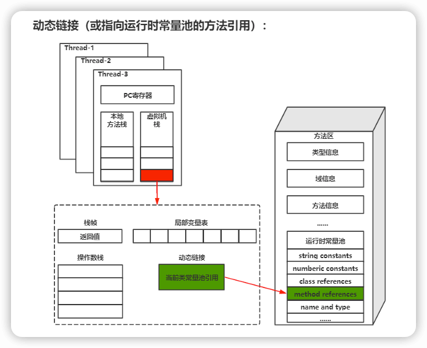

栈空间虽然不是无限的，但一般正常调用的情况下是不会出现问题的。不过，如果函数调用陷入无限循环的话，就会导致栈中被压入太多栈帧而占用太多空间，导致栈空间过深。

当线程请求栈的深度超过当前 Java 虚拟机栈的最大深度的时候，就抛出 StackOverFlowError 错误。

④**方法返回地址**

Java 方法**有两种返回方式**，一种是 return 语句正常返回，一种是抛出异常。不管哪种返回方式，**都会导致栈帧被弹出**。也就是：栈帧随着方法调用而创建，随着方法结束而销毁。**无论方法正常完成还是异常完成都算作方法结束**

除了 StackOverFlowError 错误之外，栈还可能会出现OutOfMemoryError错误，这是因为如果**栈的内存大小可以动态扩展**， 如果虚拟机在动态扩展栈时无法申请到足够的内存空间，则抛出OutOfMemoryError异常。

简单总结一下程序运行中栈可能会出现两种错误：

·**StackOverFlowError**： 若栈的内存大小不允许动态扩展，那么当**线程请求栈的深度超过**当前 Java 虚拟机栈的最大深度的时候，就抛出 StackOverFlowError 错误。

·**OutOfMemoryError**： 如果栈的内存大小可以动态扩展， 如果**虚拟机在动态扩展栈时无法申请到足够的内存空间**，则抛出OutOfMemoryError异常。

**※** **程序计数器：**

程序计数器是一块较小的内存空间，可以看作是当前线程所执行的字节码的行号指示器。

程序计数器主要有两个作用：

（1）字节码解释器通过改变程序计数器来**依次读取指令**，从而实现代码的流程控制，如：顺序执行、选择、循环、异常处理。

（2）在多线程的情况下，程序计数器用于**记录当前线程执行的位置**，从而当线程被切换回来的时候能够知道该线程上次运行到哪了。为了线程切换后能恢复到正确的执行位置，每条线程都需要有一个独立的程序计数器，各线程之间计数器互不影响，独立存储，这类内存区域称为“线程私有”的内存

注意 ：程序计数器是**唯一一个不会出现 OutOfMemoryError 的内存区域**，它的**生命周期随着线程的创建而创建，随着线程的结束而死亡**

**※** **本地方法栈：**

这些方法由本地c++实现，在 Java 虚拟机外部运行，需要通过 JNI（Java Native Interface）来和 Java 代码进行交互

public final native Class<?> getClass();

public native int hashCode();

protected native Object clone() throws CloneNotSupportedException;

和虚拟机栈所发挥的作用非常相似，区别是： 虚拟机栈为虚拟机执行 Java 方法 （也就是字节码）服务，而**本地方法栈则为虚拟机使用到的 Native 方法服务**。 **在 HotSpot 虚拟机中和 Java 虚拟机栈合二为一。**
 本地方法被执行的时候，不会在虚拟机栈中**创建栈帧，而是**在本地方法栈中**，用于存放该本地方法的局部变量表、操作数栈、动态链接、出口信息**，虚拟机栈中通过**简单的动态链接并直接调用**该方法

方法执行完毕后相应的栈帧也会出栈并释放内存空间，也会出现 StackOverFlowError 和 OutOfMemoryError 两种错误。

**native方法主要有以下两个作用：**

提供J**ava程序与底层系统**交互的能力；**提高程序执行效率**

**native****方法为什么是线程私有的呢？**

native 方法实现的本地代码可能涉及到底层系统资源的访问和操作，为了避免多个线程同时操作这些资源导致冲突

**堆：**

Java 虚拟机所管理的内存中最大的一块，Java 堆是所有线程**共享**的一块内存区域，在**虚拟机启动时创建**。

此内存区域的**唯一目的就是存放对象实例**，几乎所有的对象实例以及数组都在这里分配内存。

**所有对象共享同一个堆，但每个对象都有自己独立的堆空间，大小取决于对象的类型和实例数量。**

JDK 8 版本之后 **PermGen(永久区) 已被 Metaspace(元空间) 取代**，元空间使用的是直接内存

（PermGen 永久代 是Java虚拟机中的一个非堆内存区域，它主要用于存储类信息、常量池、静态变量等数据。）

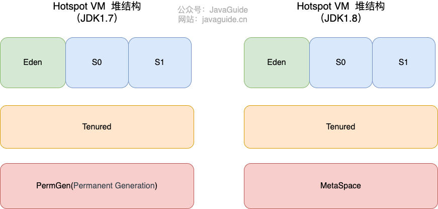

大部分情况，对象都会首先在 **Eden 区域（伊甸区）分配**，在一次新生代垃圾回收后，如果对象还存活，则会进入 **S0 或者 S1**，并且对象的年龄还会加 1(Eden 区->Survivor 区后对象的**初始年龄变为 1**)

当它的年龄增加到一定程度（默认为 **15 岁），就会被晋升到****Tenured****（老年代）**中。对象晋升到老年代的年龄阈值，可以通过参数 -XX:MaxTenuringThreshold 来设置。

**堆这里最容易出现的就是 OutOfMemoryError 错误**，并且出现这种错误之后的表现形式还会有几种，比如：

1、java.lang.OutOfMemoryError: GC Overhead Limit Exceeded ： **当 JVM 花太多时间执行垃圾回收并且只能回收很少的堆空间时**，就会发生此错误。

2、java.lang.OutOfMemoryError: Java heap space :假如**在创建新的对象时, 堆内存中的空间不足以存放新创建的对象**, 就会引发此错误。(和配置的最大堆内存有关，且受制于物理内存大小。最大堆内存可通过-Xmx参数配置，若没有特别配置，将会使用默认值

**方法区****/****永久区：** 

方法区属于是 JVM 运行时数据区域的一块逻辑区域，是各个线程共享的内存区域。

方法区会存储**已被虚拟机加载的 类信息****class****、字段信息、方法信息****method****、常量、静态变量****static**、即时编译器编译后的代码缓存等数据。

方法区和永久代以及元空间的关系很像 Java 中接口和类的关系，方法区为接口

永久代是 JDK 1.8 之前的方法区实现，JDK 1.8 及以后方法区的实现变成了元空间。

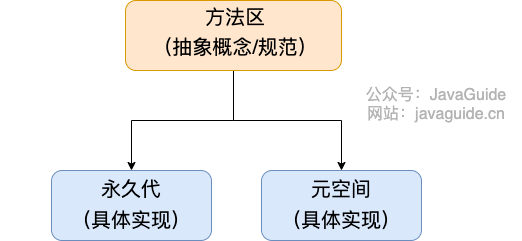

**为什么删永久代** **用元空间：**

1、**溢出几率变小了**：整个永久代有一个 JVM 本身设置的固定大小**上限，无法进行调整**，而元空间使用的是直接内存，受本机可用内存的限制，虽然元空间仍旧可能溢出，但是比原来出现的几率会更小。

2、元空间里面存放的是**类的元数据，这样加载多少类的元数据就不由 MaxPermSize 控制了**, 而由系统的实际可用空间来控制，这样能加载的类就更多了。

3、在 JDK8，**合并 HotSpot 和 JRockit 的代码时**, **JRockit 从来没有**一个叫永久代的东西, 合并之后就没有必要额外的设置这么一个永久代的地方了。

**运行时常量池：**

**Class 文件**中除了有**类的版本、字段、方法、接口**等描述信息外

还有用于存放编译期生成的**各种字面量**（Literal）和**符号引用**（Symbolic Reference）的 **常量池表**(Constant Pool Table) 。

字面量包括整数、浮点数和字符串字面量，

符号引用包括类符号引用、字段符号引用、方法符号引用和接口方法符号引用。

**常量池表会在类加载后存放到方法区的运行时常量池中**。

既然运行时常量池是方法区的一部分，自然受到方法区内存的限制，当常量池无法再申请到内存时会抛出 OutOfMemoryError 错误。

**字符串常量池：**

JVM 为了提升性能和减少内存消耗针对字符串（String 类）专门开辟的一块区域，主要目的是为了避免字符串的重复创建。

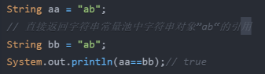

字符串常量池的实现**本质上就是一个HashSet<String>** ,容量为 StringTableSize

JDK6之前，字符串常量池在方法区内，**JDK7****之后就放在了堆内**了，如下面的图所示

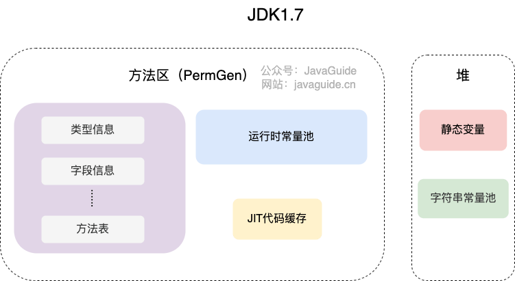

方法区实现的 GC 回收效率太低，**只有在整堆收集 (Full GC)的时候才会被执行 GC**。Java 程序中通常会有大量的被创建的字符串等待回收，将**字符串常量池放到堆中**，能够**像****Java****对象一样被垃圾回收器管理**，更高效及时地回收字符串内存。

直接内存：

不属于VM定义，但也可能导致 OutOfMemoryError 错误出现。

**JDK1.4** 中新加入的 **NIO(New Input/Output) 类**，引入了一种**基于通道（Channel）与缓存区（Buffer）的 I/O 方式**，它可以直接使用 **Native 函数库**直接分配**堆外内存**，然后通过一个**存储在 Java 堆中的 DirectByteBuffer 对象**作为这块**内存的引用**进行操作。**避免了在 Java 堆和 Native 堆之间来回复制数据**。

#### 1、heap和stack有什么区别？

- 申请方式
  - heap由系统自动分配
  - stack由程序员自己申请，并指定大小
- 申请后
  - heap：操作系统有一个记录空闲内存地址的链表，寻找第一个够大的空闲空间
  - stack
- 申请大小
  - heap：系统是用链表来存储的空闲内存地址的，是不连续的
  - stack：栈顶的地址和栈的最大容量是系统预先规定好的
- 申请效率
  - heap：速度慢，容易产生碎片
  - stack：系统自动分配，速度较快
- 存储内容
  - heap：在堆的头部用一个字节存放堆的大小
  - stack：第一个进栈的是主函数中后的下一条指令的地址；之后是此函数的各参数，参数是由右往左入栈；之后是局部变量；静态变量不入栈

#### 2、什么时候会栈内存溢出？

当线程请求的栈深度超过了虚拟机允许的最大深度时，会抛出StackOverFlowError异常。如：方法递归调用

#### 3、什么是OOM？如何排查OOM？

除了程序计数器，都有OOM的风险：

- 栈 StackOverflowError
- 常量池在堆中 java.lang.OutOfMemoryError: Java heap space
- 堆内存溢出 同上
- 方法区 OOM： 动态生成大量的类、类过大、jsp  ---懒加载、动态代理
- 直接内存OOM 

##### **排查** **OOM** **的方法**

- 增加两个参数 -XX:+HeapDumpOnOutOfMemoryError -XX:HeapDumpPath=/tmp/heapdump.hprof，当 OOM 发生时自动 dump 堆内存信息到指定目录
- jstat 查看监控 JVM 的内存和 GC 情况，先观察问题大概出在什么区域
- 使用 MAT 工具载入到 dump 文件，分析大对象的占用情况，如 HashMap 做缓存未清理，可以把改为弱引用

#### 4、JVM有哪些常量池？

- Class文件常量池：编译后的Java文件，在磁盘上
- 运行时常量池：存储编译期生成的字面量和符号引用，以及一些必要的类、方法、字段等信息，在内存中
- 全局字符串常量池：是一个叫StringTable的全局表，底层是一个维护字符串实例和引用的hashtable
- 基本类型包装类对象常量池：Byte,Short,Integer,Long,Character,Boolean，对应值≤127时才可使用对象池，**在方法区**

对于int a = 10 为例：

10 存放在虚拟机栈的局部变量表中，这个值的索引存放在指令中，即方法区中的class文件

a 是java源码的一部分，包含在字节码中，存放在方法区

JVM执行该指令时，会根据索引值到常量池中查找对应的常量值，并将它推入栈顶

#### 5、**jps,jstack,jmap**

- jps:找到机器有哪些java进程
- jconsole：查看 内存、线程 等可视化图像

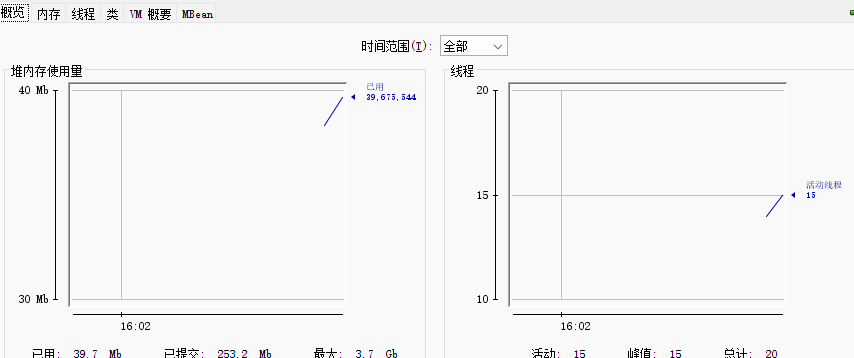

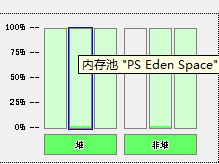

- jstat -gcutil pid time：每隔time毫秒打印一次pid进程的状态，注意此处的内存使用是百分比

  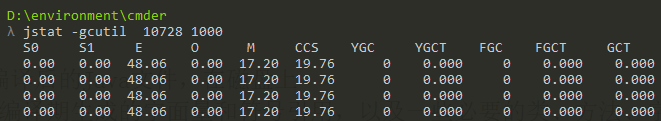

- jstat -gc pid 得到的是具体占的内存值是多少

- jstack pid 分析线程运行的信息，和jconsole的信息相同

- **jmap -dump:file=filename pid** **把内存信息下载下来，**

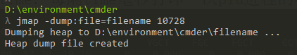

- jmap -heap pid 打印当前堆上的内存信息
- VisualVM jdk自带的工具，在bin文件夹下，包含了上面的功能如果内存占用过高，查看是哪个类下占用内存，即数据类型，去查看声明位置或者是否存在死循环
- 在VM的options中，设置-Xmx10m -Xms10m -XX:+HeapDumpOnOutOfMemoryError 当OOM的时候自动去dump下来文件

### HotSpot 虚拟机对象探秘

#### 1、**对象的创建**

Step1:类加载检查

Step2:分配内存

Step3:初始化零值

Step4:设置对象头

Step5:执行 init 方法

Step1:

虚拟机遇到一条 new 指令时，首先将去检查这个指令的参数**是否能在运行常量池中定位到这个类的符号引用**，并且检查**这个符号引用代表的类是否已被加载过、解析和初始化过**。如果没有，那必须先执行相应的类加载过程。

Step2:

在类加载检查通过后，接下来虚拟机将为新生对象分配内存。**对象所需的内存大小在类加载完成后便可确定**，为对象分配空间的任务等同于把一块**确定大小的连续内存**从 Java 堆中划分出来。分配方式有 **“指针碰撞” 和 “空闲列表”** 两种，选择哪种分配方式由 Java 堆是否规整决定，而 Java 堆是否规整又由所采用的垃圾收集器是否带有压缩整理功能决定。

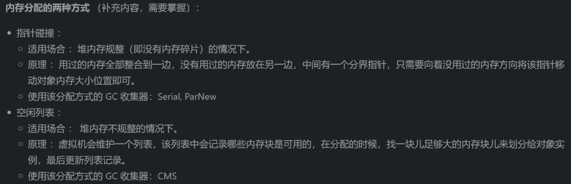

Java 堆内存是否规整，取决于 GC 收集器的算法**是"标记-清除"，还是"标记-整理"**（也称作"标记-压缩"）

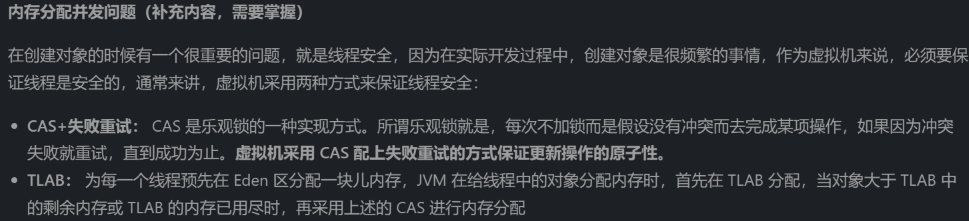

Step3:

内存分配完成后，虚拟机需要将分配到的**内存空间都初始化为零值**（不包括对象头），这一步操作保证了对象的实例字段在 Java 代码中可以不赋初始值就直接使用，程序能访问到这些字段的数据类型所对应的零值。

Step4:

初始化零值完成之后，虚拟机要对对象进行必要的设置，例如这个对象**是哪个类的实例**、**如何才能找到类的元数据信息**、对象的**哈希码**、对象的 **GC 分代年龄**等信息。 这些信息存放在**对象头中**。 另外，根据虚拟机当前运行状态的不同，如是否启用偏向锁等，对象头会有不同的设置方式。

Step5:

在上面工作都完成之后，从虚拟机的视角来看，一个新的对象已经产生了，但从 Java 程序的视角来看，对象创建才刚开始，**<init> 方法还没有执行**，所有的字段都还为零。所以一般来说，**执行 new 指令之后会接着执行 <init> 方法**，把对象按照程序员的意愿进行初始化，这样一个真正可用的对象才算完全产生出来。

#### 2、**对象的内存布局**

布局可以分为 3 块区域：**对象头**、**实例数据**和**对齐填充**

Hotspot 虚拟机的**对象头**包括两部分信息：

第一部分用于存储**对象自身的运行时数据**（**哈希码、GC 分代年龄**、锁状态标志等等），

另一部分是**类型指针**，即**对象指向它的类元数据的指针**，虚拟机通过这个指针来确定这个对象是哪个类的实例

**实例数据部分**是对象真正存储的**有效信息**，也是在程序中所定义的各种类型的字段内容

**对齐填充部分**不是必然存在的，也没有什么特别的含义，仅仅起占位作用。Hotspot 虚拟机的自动内存管理系统要求对象起始地址必须是 **8 字节的整数倍**，对象头部分正好是 8 字节的倍数，对齐填充为了补实例数据的位数

#### 3、**对象的访问定位**

Java 程序通过**栈上的 reference 数据来操作堆上的具体对象**。

对象的访问方式由虚拟机实现而定，目前主流的访问方式有：使用句柄、直接指针。

**句柄：**

Java **堆中**将会划分出一块内存来作为**句柄池**，reference 中存储的就是对象的**句柄地址**，而句柄中包含了对象**实例数据**与对象**类型数据**各自的具体地址信息

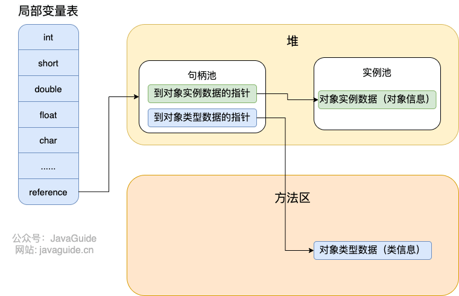

**直接指针：**

如果使用直接指针访问，**reference 中存储的直接就是对象的地址**。

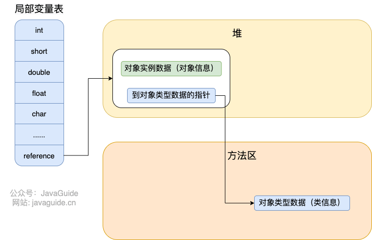

优缺点：

句柄：最大好处是 reference 中存储的是稳定的句柄地址，在对象被移动时只会改变句柄中的实例数据**指针**，而reference本身不需要修改

直接指针；速度快，节省了一次指针定位的时间开销。

直接指针：对象实例数据的地址可能会发生变化，如垃圾回收时，此时所有指向对象实例数据的引用都需要修改

### **JVM 垃圾回收详解**

#### 1、堆空间的基本结构

Java 的自动内存管理主要是针对对象内存的回收和对象内存的分配,**最核心的功能是堆内存中对象的分配与回收**。

Java 堆是垃圾收集器管理的主要区域，因此也被称作 GC堆（Garbage Collected Heap）

JDK8 之后：

 

新生代内存(Young Generation)：Eden 区、两个 Survivor 区 S0 和 S1 都属于新生代

老生代(Old Generation)

元空间(Metaspace)：元空间使用的是直接内存

#### 2、**内存分配和回收原则**

大多数情况下，对象在新生代中 Eden 区分配。当 **Eden 区没有足够空间**进行分配时，虚拟机将**发起一次 Minor GC**。

执行 Minor GC 后，后面分配的对象如果能够存在 Eden 区的话，还是会在 Eden 区分配内存。

Eden 区没有足够空间进行分配时，通过 **分配担保机制** 把新生代的对象提前转移到老年代中去

**※大对象：**需要大量连续内存空间的对象（比如：**字符串、数组**）

**大对象直接进入老年代**主要是为了避免为大对象分配内存时由于分配担保机制带来的复制而降低效率

**※长期存活的对象将进入老年代**

- 虚拟机给每个对象一个对象年龄（Age）计数器

- 大部分情况，对象都会首先在 Eden 区域分配；如果对象在 Eden 出生并经过第一次 Minor GC 后仍然能够存活，并且能被 Survivor 容纳的话，将被移动到 Survivor 空间（s0 或者 s1）中；并将对象年龄设为 1(**Eden 区->Survivor 区后对象的初始年龄变为 1**)

- 当 S0 或 S1 区被填满时，其中仍然存活的对象会**被复制到另一个空的 S 区中，同时清空原来的 S 区**。

- 对象在 Survivor 中每熬过一次 MinorGC,年龄就增加 1 岁，当它的年龄增加到一定程度（默认为 **15 岁**，CMS中是6岁），就会被**晋升到老年代中**

**※主要进行 gc 的区域**

分类：

·PartialGC:并不收集整个GC堆的模式

 ·Young GC: 只收集young gen的GC

 ·Old GC:只收集old gen的GC。**只有CMS**的concurrent collection是这个模式

 ·Mixed GC:收集整个young gen以及部分old gen的GC。**只有G1有这个模式**

·**Full GC: 收集整个堆**，包括young gen、old gen、perm gen (如果存在的话)等所有部分的模 （**major GC****同**

**※** **触发条件：**

·young GC:当young gen中的eden区分配满的时候触发。注意young GC中有部分存活对象会晋升到old gen，所以young GC后old gen的占用量通常会有所升高。

·full GC: 当准备要触发一次young GC时，如果发现统计数据说之前**young GC的平均晋升大小比目前old gen剩余的空间大**，则不会触发young GC而是转为**触发full GC** (因为HotSpot VM的GC里，除了CMS的concurrent collection之外，其它能收集old gen的GC**都会同时收集整个GC堆**包括young gen，所以不需要事先触发一次单独的young GC);或者，如果有perm gen的话,要在perm gen分配空间但已经没有足够空间时，也要触发一次full GC;或者System.gc()、heapdump带GC，默认也是触发full GC。

**默认在触发** **full GC **前先执行一次**young GC** **（ **Oracle 、Open、IBM的JDK是这样的）

**※** **部分收集 (Partial GC)：**

- 新生代收集（Minor GC / Young GC）：只对新生代进行垃圾收集；

- 老年代收集（Major GC / Old GC）：只对老年代进行垃圾收集。需要注意的是 Major GC 在有的语境中也用于指代整堆收集；

- 混合收集（Mixed GC）：对整个新生代和部分老年代进行垃圾收集。

- 整堆收集 (Full GC)：收集整个 Java 堆和方法区

**※** **空间分配担保：**

--空间分配担保为了确保在 **Minor GC** 之前，会查看老年代最大可用的连续空间**是否还可容纳**新生代**所有**对象

--不成立，则Minor GC不安全，会查看是否**允许担保失败**(Handle Promotion Failure)

--若允许，会继续检查老年代最大可用的连续空间是否大于历次晋升到老年代对象的平均大小

--若大于，则会发生一次Minor GC ，不安全的

--若不允许担保失败，则将Full GC

#### 3、**死亡对象判断方法**

堆中几乎放着所有的对象实例，垃圾回收第一步即看对象是否死亡

##### **引用计数法**

给对象中添加一个**引用计数器**：实现简单，效率高，但**很难解决对象之间相互循环引用的问题（两个对象互相引用，计数永远不会变成****0****，永远无法被回收）**

- 引用计数器的初始值为0

- 每当有一个地方引用它，计数器就加 1；

- 当引用失效，计数器就减 1；

- 任何时候计数器为 0 的对象就是不可能再被使用的。

**可达性分析算法**

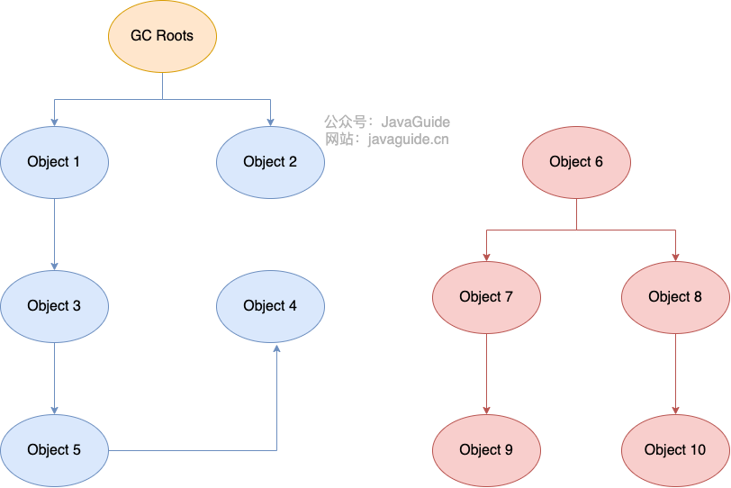

通过称为 “GC Roots” 的对象作为起点，从这些节点开始向下搜索，节点所走过的路径称为引用链

一个对象的 GC Roots **没有任何引用链相连的话**，则证明此对象是**不可用**的，需要被回收

Object6-10虽然有引用关系，但它们到 **GC Roots 不可达**，因此为**需要被回收**的对象

**※** **哪些对象可以作为 GC Roots ？**

- **虚拟机栈(栈帧中的本地变量表)中引用的对象**

- **本地方法栈**(**Native 方法)中引用的对象**

- 方法区中**类静态属性引用的对象**

- 方法区中**常量引用的对象**

- 所有**被同步锁持有的对象**

**※** **对象可以被回收，就代表一定会被回收吗？**

否

（JDK9 版本及后续版本中各个类中的 finalize 方法会被逐渐弃用移除。）

一个对象死亡，**至少要经历两次标记过程**；不可达的对象被第一次标记并且进行一次筛选，条件是此对象**是否有必要执行finalize方法**

当对象没有覆盖 finalize 方法，或 finalize 方法已经被虚拟机调用过时，**没必要死亡**

被判定为需要执行的对象将会被**放在一个队列中进行第二次标记**，除非这个对象与引用链上的任何一个对象建立关联，否则就会被真的回收

 

Object 类中的 finalize 方法一直被认为是一个糟糕的设计，成为了 Java 语言的负担，影响了 Java 语言的安全和 GC 的性能。JDK9之后就移除了

#### **引用类型总结**

引用分为强引用、软引用、弱引用、虚引用四种（引用强度逐渐减弱）

强引用：把一个对象赋给一个引用变量，这个引用变量就是强引用

软引用：继承SoftReference实现，

弱引用：继承WeakReference实现，

虚引用：继承PhantomReference实现，

举例：

Object obj = new Object();

SoftReference<byte[]> ref = new SoftReference<>(new byte[1024 * 1024]);

WeakReference<Object> ref = new WeakReference<>(new Object());

PhantomReference<Object> ref = new PhantomReference<>(new Object(), null);

**回收规则：**

- 强引用（StrongReference）使用最普遍的引用，垃圾回收器绝不会回收它。当内存空间不足，Java 虚拟机**宁愿抛出 OutOfMemoryError 错误，也不会靠随意回收**。

- 软引用（SoftReference）如果一个对象只具有软引用，则可有可无。内存空间足够，垃圾回收器就不回收，内存空间不足，就会回收。只要垃圾回收器没有回收它，该对象就可以被程序使用。软引用可用来实现内存敏感的高速缓存。软引用可以和一个引用队列（ReferenceQueue）联合使用，如果软引用所引用的对象**被垃圾回收**，JAVA 虚拟机就会把这个软引用**加入到与之关联的引用队列中**。

  引用队列：可做内存泄漏检测、缓存清理、对象复活等操作。

- 弱引用（WeakReference）如果一个对象只具有弱引用，那可有可无。弱引用与软引用的**区别在于**：只具有弱引用的对象拥有**更短暂**的生命周期。在垃圾回收器线程扫描它所管辖的内存区域，**发现就回收**。但由于垃圾回收器是一个优先级很低的线程， 不一定会很快发现那些只具有弱引用的对象。弱引用可以和一个引用队列（ReferenceQueue）联合使用，如果弱引用所引用的对象被垃圾回收，Java 虚拟机就会把这个弱引用加入到与之关联的引用队列中。

- 虚引用（PhantomReference）虚引用，形同虚设，虚引用并不会决定对象的生命周期。如果一个对象仅持有虚引用，那么它就和没有任何引用一样，在**任何时候都可能被垃圾回收**。

#### **如何判断一个常量是废弃常量？**

字符串常量池被单独拿到堆,运行时常量池剩下的东西还在方法区, 也就是 hotspot 中的元空间。

如果当前**没有任何 String 对象引用该字符串常量的话，那此常量就是废弃常量**

#### **如何判断一个类是无用的类？**

- 该类所有的实例都已经被回收，也就是 **Java 堆中不存在该类的任何实例**
- **加载该类的 ClassLoader 已经被回收**。
- 该类对应的 java.lang.Class 对象**没有在任何地方被引用**，无法在任何地方通过反射访问该类的方法。

#### **垃圾收集算法**

##### **标记-清除算法** （基础算法）

首先**标记**出所有**不需要回收的对象**，在标记完成后**统一回收掉**所有**没有被标记的对象**

存在两个问题：①效率低 ②空间碎片

##### **标记-复制算法** （整块回收  例如S0和S1

将内存分为大小相同的两块，每次**使用其中的一块**.

当这一块的内存使用完后，就将还存活的对象**复制到另一块去**，然后再把使用的**空间一次清理掉**

##### **标记-整理算法** （年代、对齐)

与 4.1 类似，回收阶段是让**所有存活的对象向一端移动**，然后直接清理掉端边界以外的内存

##### **分代收集算法**

将 java 堆分为新生代和老年代

如：**新生代大量死亡，使用** **4.2** **；老年代存活率高，使用****4.1****或****4.3**

**HotSpot 为什么要分为新生代和老年代？**

根据上面的回答

#### 5、垃圾收集器

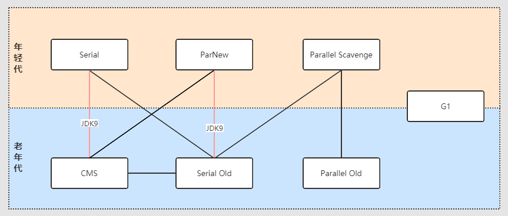

年轻代的都是 标记-复制算法

老年代中，CMS是标记-清除算法，另外两个是标记-整理算法

G1是标记-复制算法 和 标记-整理算法

##### **Serial （串行）收集器**

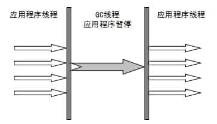

**单线程**，进行垃圾收集工作的时候必须暂停其他所有的工作线程

新生代采用标记-复制算法，老年代采用标记-整理算法

简单而高效，适合运行在 Client 模式下的虚拟机

##### **ParNew 收集器**

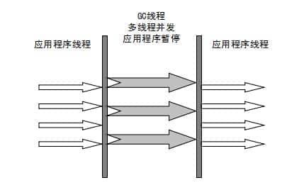

Serial 收集器的多线程版本，除了使用**多线程进行垃圾收集**外，其余行为（控制参数、收集算法、回收策略等等）和 Serial 收集器完全一样。

适用于运行在 Server 模式下的虚拟机

 

并行与并发：

并行：多条垃圾收集线程并行工作，但此时**用户线程仍然处于等待状态**

并发：用户线程与垃圾收集线程同时执行，不一定并行可能交替执行

##### **Parallel Scavenge 收集器**

使用标记-复制算法的多线程收集器

**关注点是吞吐量**（高效率的利用 CPU），其他的收集器关注的更多的是用户线程的停顿时间（提高用户体验）

新生代采用标记-复制算法，老年代采用标记-整理算法

##### Serial Old 收集器

单线程，

两大用途：一种用途是在 JDK1.5 以及以前的版本中与 Parallel Scavenge 收集器搭配使用，另一种用途是作为 CMS 收集器的后备方案

##### Parallel Old 收集器

使用多线程和“标记-整理”算法

##### **CMS 收集器**   **Concurrent Mark Sweep**

是一种以获取最短回收停顿时间为目标的收集器  “标记-清除”算法  注重用户体验HotSpot 虚拟机第一款真正意义上的并发收集器，第一次实现了让垃圾收集线程与用户线程（基本上）同时工作。

四步骤：

- 初始标记：STW，**暂停所有的其他线程**，并记录下**直接与 root 相连的对象**，速度很快 ；

- 并发标记： 同时开启 GC 和用户线程，用一个闭包结构去记录可达对象。但在这个阶段结束，这个闭包结构并不能保证包含当前所有的可达对象。**因为用户线程可能会不断的更新引用域**，所以 GC 线程无法保证可达性分析的实时性。所以这个算法里会跟踪记录这些发生引用更新的地方。

- 重新标记：STW，重新标记阶段就是为了修正并发标记期间因为用户程序继续运行而导致标记产生变动的那一部分对象的标记记录，这个阶段的停顿时间一般会比初始标记阶段的时间稍长，远远比并发标记阶段时间短

- 并发清除： 开启用户线程，同时 GC 线程开始对未标记的区域做清扫

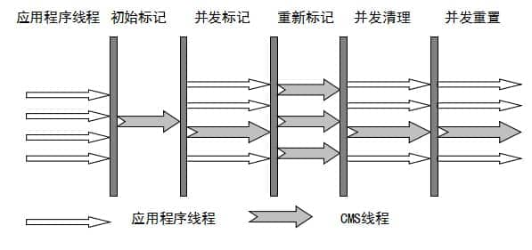

优点：并发收集、低停顿

缺点：对 **CPU 资源敏感**、**无法处理浮动垃圾**、回收算法-“标记-清除”算法**会导致空间碎片**

##### **G1 收集器**

功能：

- 将内存划分为多个大小相等的Region，每个Region可扮演新生代、老年代、持久代

- 维护了一个**优先列表**，每次根据允许的收集时间，优先选择回收价值最大的 Region

面向服务器的垃圾收集器 极高概率满足 GC 停顿时间要求的同时,还具备高吞吐量性能特征

特点：

- 并行与并发：多核多CPU，缩短停顿时间
- 分代收集：保留了分代的概念
- 空间整合：从整体来看是基于“标记-整理”算法；从局部上来看是基于“标记-复制”算法
- 可预测的停顿：G1建立可预测的停顿时间模型，明确指定在一个长度为 M 毫秒的时间片段内步骤：
  - 初始标记：STW，标记从 GC Root 开始直接关联可达的对象
  - 并发标记：和用户线程并发执行，递归扫描整个堆里的对象做可达性分析
  - 最终标记：STW，标记在并发标记过程中产生的垃圾
  - 筛选回收：STW，制定回收计划，选择多个Region构成回收集，把回收的Region中的存活对象复制到空的 Region 中，清理整个旧Region

##### **ZGC 收集器**

与 CMS 中的 ParNew 和 G1 类似，停顿时间情况更少

使用场景划分：

- Serial ：如果应用程序有一个很小的内存空间（大约 100 MB）亦或它在没有停顿时间要求的单线程处理器上运行。
- Parallel：如果优先考虑应用程序的峰值性能，并且没有时间要求要求，或者可以接受 1 秒或更长的停顿时间
- CMS/G1：如果响应时间比吞吐量优先级高，或者垃圾收集暂停必须保持在大约 1 秒以内。
- ZGC：如果响应时间是高优先级的，或者堆空间比较大

